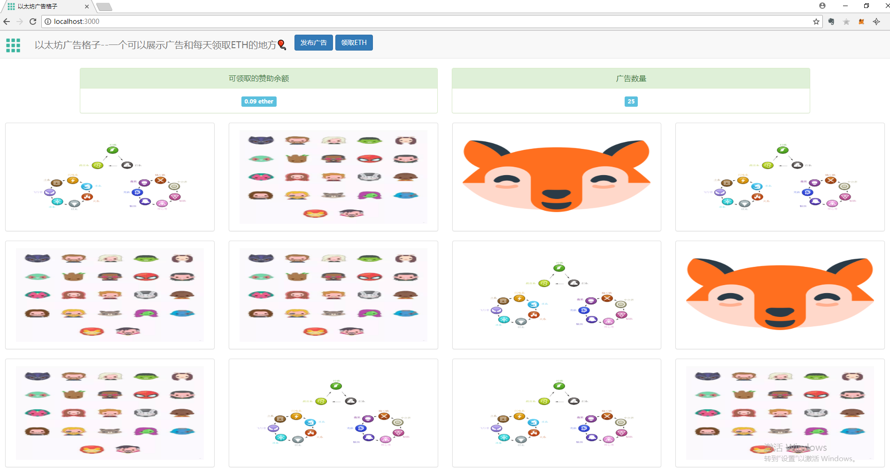

# eth-ad-grid
以太坊广告格子V1.0

# 功能
- 发布广告作为赞助商，每次花费0.1ETH
- 用户每天可以领取0.01ETH

# 效果

# 运行项目
- 启动后端：进入backend目录执行，python manage.py runserver 0.0.0.0:9999
- 启动：ganache-cli
- npm install
- truffle migrate
- npm run dev
